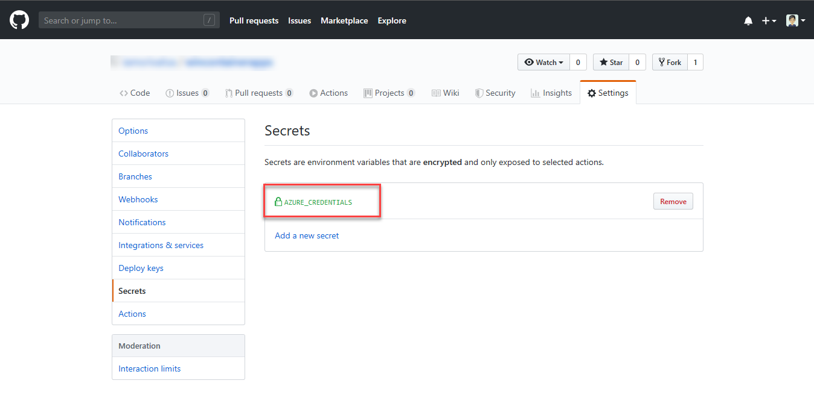

# MLOps: DevOps for Machine Learning

This repository contains example MLOps pipeline (bulit using Azure Machine Learning and GitHub Actions) for training, registering, serving, and managing machine learning models.

## Pre-requisite

- [Azure Machine Learning Python SDK](https://docs.microsoft.com/en-us/python/api/overview/azure/ml/?view=azure-ml-py)

## Getting Started

- Create new Azure Machine Learning service
- Navigate to [AML Studio](https://ml.azure.com/)
- Create new [compute instance](https://docs.microsoft.com/en-us/azure/machine-learning/concept-compute-instance)
- After compute instance is provisioned, access JupyterLab
- Clone this repo in JupyterLab
- Unzip `data/porto_seguro_safe_driver_prediction_input.7z` to `data/porto_seguro_safe_driver_prediction_input.csv`

### Setting up the required secrets

#### To allow GitHub Actions to access Azure
An [Azure service principal](https://docs.microsoft.com/en-us/azure/active-directory/develop/app-objects-and-service-principals) needs to be generated. Just go to the Azure Portal to find the details of your resource group. Then start the Cloud CLI or install the [Azure CLI](https://docs.microsoft.com/en-us/cli/azure/install-azure-cli?view=azure-cli-latest) on your computer and execute the following command to generate the required credentials:

```sh
# Replace {service-principal-name}, {subscription-id} and {resource-group} with your
# Azure subscription id and resource group name and any name for your service principle
az ad sp create-for-rbac --name {service-principal-name} \
                         --role contributor \
                         --scopes /subscriptions/{subscription-id}/resourceGroups/{resource-group} \
                         --sdk-auth
```

This will generate the following JSON output:

```sh
{
  "clientId": "<GUID>",
  "clientSecret": "<GUID>",
  "subscriptionId": "<GUID>",
  "tenantId": "<GUID>",
  (...)
}
```

Add this JSON output as [a secret](https://help.github.com/en/actions/configuring-and-managing-workflows/creating-and-storing-encrypted-secrets#creating-encrypted-secrets) with the name `AZURE_CREDENTIALS` in your GitHub repository:

<p align="center">
  
</p>

To do so, click on the Settings tab in your repository, then click on Secrets and finally add the new secret with the name `AZURE_CREDENTIALS` to your repository.

Please follow [this link](https://help.github.com/en/actions/configuring-and-managing-workflows/creating-and-storing-encrypted-secrets#creating-encrypted-secrets) for more details.

#### To Allow Azure to trigger a GitHub Workflow
 We also need GH PAT token with `repo` access so that we can trigger a GH workflow when the training is completed on Azure Machine Learning.

 <p align="center">
  
</p>

 Add the PAT token with as [a secret](https://help.github.com/en/actions/configuring-and-managing-workflows/creating-and-storing-encrypted-secrets#creating-encrypted-secrets) with the name `PATTOKEN` in your GitHub repository:
 <p align="center">
  
</p>

## TODOs

- Create requirements.txt
- Create setup script
  - Unzip data file
  - Register AML dataset
  - Setup CI pipeline for data changes?

---

### PLEASE NOTE FOR THE ENTIRETY OF THIS REPOSITORY AND ALL ASSETS

1. No warranties or guarantees are made or implied.
2. All assets here are provided by me "as is". Use at your own risk. Validate before use.
3. I am not representing my employer with these assets, and my employer assumes no liability whatsoever, and will not provide support, for any use of these assets.
4. Use of the assets in this repo in your Azure environment may or will incur Azure usage and charges. You are completely responsible for monitoring and managing your Azure usage.

---

Unless otherwise noted, all assets here are authored by me. Feel free to examine, learn from, comment, and re-use (subject to the above) as needed and without intellectual property restrictions.

If anything here helps you, attribution and/or a quick note is much appreciated.